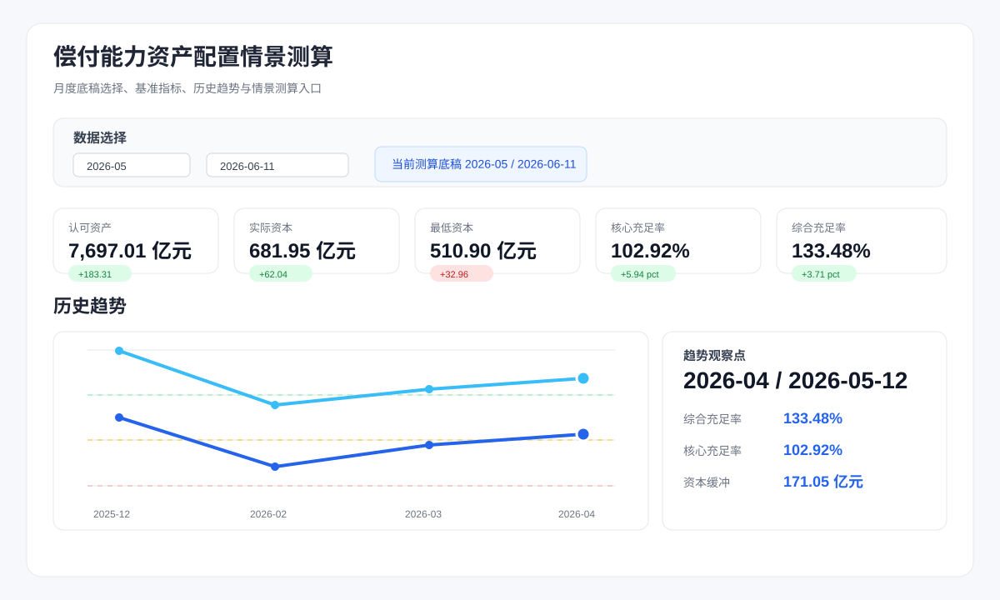
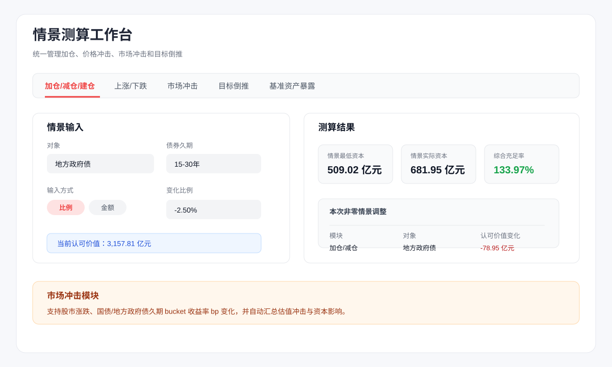
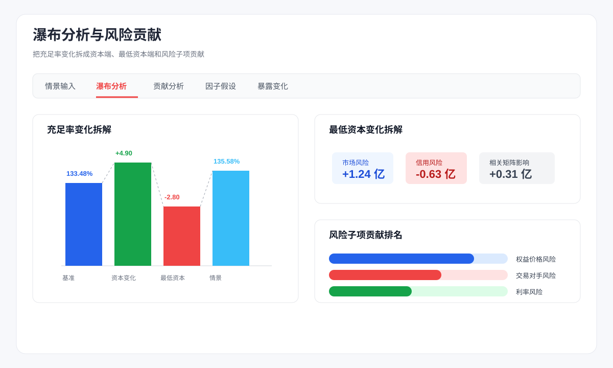

# 偿付能力资产配置情景测算

一个面向保险资金资产配置和偿付能力敏感性分析的 Streamlit 应用。项目从月度偿付能力 Excel 底稿中读取核心监管指标、资产暴露和最低资本明细，支持快速比较历史趋势、构建资产调整情景，并观察对实际资本、最低资本和偿付能力充足率的影响。

> 该工具用于内部管理测算、组合敏感性分析和汇报材料准备，不替代监管报送系统或完整偿二代复算引擎。

## 界面预览

以下图片为基于当前 Streamlit 页面结构制作的脱敏界面预览，可作为个人主页或项目介绍材料的展示素材。







## 功能亮点

- **月度底稿管理**：自动扫描 `origin stats/` 下的多期 Excel 底稿，按报告月份和底稿时点选择测算口径。
- **历史趋势看板**：展示认可资产、实际资本、最低资本、核心/综合偿付能力充足率和环比变化，并加入 100%、120%、150% 监管参考线。
- **资产配置情景**：支持按资产类型做加仓、减仓、建仓、价格上涨/下跌等情景测算，金额统一以亿元展示。
- **市场冲击模块**：支持股市涨跌、国债和地方政府债按久期 bucket 输入收益率 bp 变化。
- **目标倒推**：输入核心或综合偿付能力充足率目标变化，倒推出单一资产类型所需的最小调整金额或比例。
- **瀑布拆解**：把充足率变化拆解为资本端影响、最低资本端影响和风险子项贡献，便于解释情景结果。
- **监管口径透明**：页面保留风险因子、暴露变化、分账户资本和原始报表明细，方便追溯。

## 数据输入

应用会读取 `origin stats/` 目录下的 `.xlsx` 月度底稿。文件名约定为：

```text
公司代码_报告月末_底稿时点[版本].xlsx
```

示例：

```text
1000_20260430_20260512.xlsx
1000_20251231_20260113v2.xlsx
```

当前解析依赖的主要 sheet：

- `S01_`：基准偿付能力指标。
- `S05_`：量化风险最低资本和风险子项。
- `KBQS_V_`：资产类型、认可价值和各类风险暴露。
- `MC_RESULT_`：资产端利率风险明细，用于反推利率风险因子和久期 bucket。
- `CAL_DETAIL_`：最低资本明细，用于反推利差风险因子。
- `FLS05ACC_`：分账户资本明细。

## 运行方式

建议使用项目虚拟环境启动，避免和系统 Python 或 Homebrew Python 混用：

```bash
.venv/bin/python -m streamlit run app.py
```

如需重建环境：

```bash
python -m venv .venv
.venv/bin/python -m pip install -r requirements.txt
.venv/bin/python -m streamlit run app.py
```

打开页面后，在“数据选择”模块中选择报告月份和底稿时点，应用会自动加载对应底稿并刷新后续测算模块。

## 核心测算口径

- 从 `S01` 和 `S05` 读取基准认可资产、实际资本、最低资本、核心资本和偿付能力充足率。
- 从 `KBQS_V` 汇总资产类型维度的认可价值和风险暴露。
- 从 `MC_RESULT_资产端利率风险明细表` 按资产类型和久期 bucket 反推利率风险相关因子：

```text
利率风险资产价值 = 账面价值净价 + 应收利息
利率风险抵减因子 = 资产端利率风险MC / 利率风险资产价值
PV口径抵减因子 = 资产端利率风险MC / PV基础
```

- 展示层的利率风险暴露优先采用 PV 口径抵减因子；当 PV 基础缺失时回退到利率风险资产价值口径。
- 从 `CAL_DETAIL_最低资本明细表` 按资产类型反推利差风险因子：

```text
利差风险因子 = 利差风险MC / 利差风险暴露
```

- 市场风险、信用风险和量化风险会按相关矩阵重算情景增量，再叠加到底稿基准值。
- 加仓/减仓/建仓默认只调整资产配置和风险暴露，不自动增加实际资本；页面可勾选“认可资产变化同步实际资本”。
- 上涨/下跌默认把估值变化计入实际资本和核心资本，因为该模块模拟已有资产的公允价值变化。
- 目标倒推中的目标值会自动换算为相对当前基准充足率的百分点变化。

更完整的计算说明见 [docs/calculation_logic.md](docs/calculation_logic.md)。

## 项目结构

```text
.
├── app.py                         # Streamlit 应用入口
├── solvency_app/
│   ├── workbook.py                # Excel 底稿发现、解析和校验
│   ├── scenario.py                # 情景测算、资本增量和相关矩阵
│   ├── target.py                  # 目标倒推求解
│   └── policies.py                # 政策 overlay 参数
├── origin stats/                  # 月度偿付能力底稿
├── docs/
│   ├── calculation_logic.md       # 计算逻辑说明
│   └── images/                    # README 展示图
├── tests/                         # 口径和情景测试
├── requirements.txt
└── runtime.txt
```

## 测试

```bash
.venv/bin/python -m pytest
```

## 技术栈

- Python
- Streamlit
- Pandas
- OpenPyXL
- Altair

## 适用场景

- 月度偿付能力指标复盘。
- 资产配置调整前的敏感性测算。
- 股市、利率和地方政府债冲击的快速情景分析。
- 向管理层解释“充足率变化来自哪里”。
- 为个人主页、项目作品集或内部汇报提供可视化案例。
